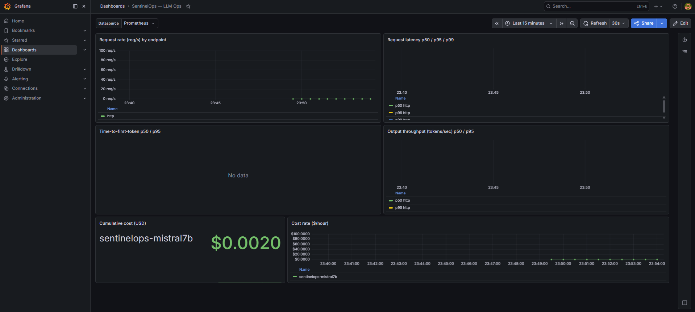
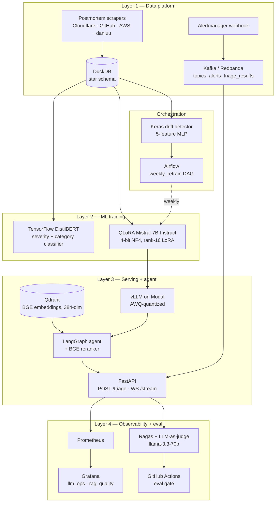

# SentinelOps

> An agentic LLM copilot for SRE incident response — fine-tuned, retrieval-augmented, observable.

[](https://huggingface.co/ayushgupta7777/sentinelops-mistral7b-awq)
[](https://huggingface.co/ayushgupta7777/sentinelops-mistral7b-qlora-adapter)
[](https://huggingface.co/ayushgupta7777/sentinelops-classifier)
[](https://github.com/ayushgupta07xx/sentinelops/actions)
[](LICENSE)

SentinelOps drafts incident postmortems and triages alerts using **Mistral-7B-Instruct** fine-tuned via **QLoRA** on a self-compiled corpus of 2,000+ real public postmortems (Cloudflare, GitHub, AWS, danluu/post-mortems). It is retrieval-augmented over runbooks and historical incidents via **Qdrant + BGE embeddings + cross-encoder reranking**, orchestrated as a **LangGraph** agent with tool-use, served via **vLLM** on Modal, and deployed end-to-end on **Kubernetes** with **Prometheus + Grafana** dashboards and a **Ragas-based CI eval gate**.

Built solo in 5 weeks on free compute. Total spend: ₹0.

---

## Demo

📹 **[2-minute walkthrough](docs/demo.md#video)** — chaos in upstream service → Alertmanager → Kafka → LangGraph agent → drafted postmortem → Grafana panels light up.



---

## Architecture

Four-layer system: data ingestion → ML training → agent serving → observability, with Airflow orchestrating weekly retrains and a Keras drift detector gating the retrain branch.



Full breakdown with per-component justifications: [`docs/architecture.md`](docs/architecture.md).

---

## Tech stack

| Layer | Tools |
| --- | --- |
| **Data** | Kafka (Redpanda), Airflow, DuckDB, Presidio (PII), MinHash dedup |
| **Training** | PyTorch, Transformers, PEFT, TRL, bitsandbytes (QLoRA), TensorFlow + Keras (DistilBERT classifier + drift detector), W&B, MLflow |
| **Retrieval** | Qdrant, BAAI/bge-small-en-v1.5, BAAI/bge-reranker-base |
| **Agent + serving** | LangGraph, FastAPI + WebSockets, vLLM, AWQ 4-bit quantization, Modal |
| **Evaluation** | Ragas (faithfulness, answer relevance, context precision/recall), LLM-as-judge via Groq (llama-3.3-70b-versatile canonical, llama-3.1-8b-instant CI inner-loop) |
| **Observability** | Prometheus, Grafana, kube-prometheus-stack ServiceMonitors |
| **Deploy** | kind (local K8s), Helm (single reusable microservice chart), ArgoCD GitOps, GitHub Actions, Trivy |
| **CI gates** | Lint · type-check · unit tests · Trivy CVE scan · Ragas faithfulness gate |

Every choice — and every alternative we rejected — is documented in [`docs/decisions.md`](docs/decisions.md).

---

## Model performance

Numbers below are reported with measurement context. Full methodology, failure-mode analysis, intended use, limitations, and bias / PII notes live in [`docs/model_card.md`](docs/model_card.md).

### QLoRA-fine-tuned Mistral-7B-Instruct

| Metric | Value | Sample | Grader |
| --- | --- | --- | --- |
| Faithfulness (canonical) | **0.63** | 20-case golden set | `llama-3.3-70b-versatile` (Groq) |
| Faithfulness (CI baseline) | **0.51** | 10-case fast set | `llama-3.1-8b-instant` (Groq) |
| Answer relevancy | **0.66** | 10-case fast set | `llama-3.1-8b-instant` |
| Context precision | **0.79** | 10-case fast set | `llama-3.1-8b-instant` |
| Context recall | **0.34** | 10-case fast set | `llama-3.1-8b-instant` |

The 0.63 figure is below the brief's 0.75 target. The dominant failure mode is *specific-detail confabulation under sparse evidence* — when a one-line alert (e.g. `KafkaConsumerLagHigh lag=15000`) yields generic runbook chunks, the fluency-trained model invents plausible timestamps, pod names, and root causes rather than abstaining. This is named explicitly in the [model card](docs/model_card.md#failure-modes) rather than chased through prompt iteration on the eval set.

### DistilBERT incident classifier (non-generative baseline)

| Head | Accuracy | Macro-F1 | Test set |
| --- | --- | --- | --- |
| Severity (P0/P1/P2/P3) | 0.48 | 0.36 | n=27 |
| Category (6 classes) | 0.30 | 0.36 | n=27 |

Test set is small (27 examples — labeled-data budget for a 5-week solo project) and per-class F1 has high variance. The classifier exists as a benchmark surface for the LLM, not as a production triage component. Full caveats and confusion matrices on the [HuggingFace model card](https://huggingface.co/ayushgupta7777/sentinelops-classifier).

### Serving

End-to-end `/triage` warm-path latency on Modal (vLLM + AWQ Mistral-7B): **~120–140 s**. The LLM call dominates (~80 s for ~2,500 generated chars), with the rest split across BGE retrieval + reranking, the Prometheus tool stub, and agent orchestration. Cold start after Modal scale-to-zero: **~3 min** on first call (vLLM loads the 7B).Documented in the [demo runbook](docs/demo.md#latency-expectations).

---

## Quickstart

**Prereqs:** Docker Desktop, kubectl, kind, Helm, Python 3.11, a Modal account, a Groq API key, an HF token.

```bash
git clone https://github.com/ayushgupta07xx/sentinelops.git
cd sentinelops

# 1. Python env
python3.11 -m venv .venv && source .venv/bin/activate
pip install -e ".[dev]"

# 2. Local services (Redpanda + Postgres + Airflow)
docker compose up -d redpanda postgres airflow

# 3. Kubernetes stack (kind + ArgoCD + monitoring + qdrant + api microservice)
./bootstrap.sh                             # one-shot cluster bring-up

# 4. Deploy fine-tuned model to Modal
cp .env.example .env && $EDITOR .env       # fill MODAL + GROQ + HF tokens
modal deploy serving/inference/modal_vllm.py

# 5. Smoke-test /triage (port-forward in another terminal)
kubectl -n sentinelops port-forward svc/sentinelops-api-microservice 8001:80 &
curl -X POST http://localhost:8001/triage \
  -H 'Content-Type: application/json' \
  -d @docs/demo/sample_alert.json

# 6. (Optional) Run the React UI for a clickable demo
cd serving/ui
npm install
npm run dev                                # http://localhost:5173
```

Full reproduction walkthrough with timing expectations, troubleshooting, and demo replay: [`docs/demo.md`](docs/demo.md).

---

## Repo layout

```
sentinelops/
├── data/               # scrapers, preprocessing, DuckDB warehouse
├── training/
│   ├── classifier/     # TensorFlow DistilBERT (severity + category)
│   ├── llm/            # PyTorch QLoRA fine-tuning + AWQ quantization
│   └── drift/          # Keras 5-feature MLP drift detector
├── serving/
│   ├── api/            # FastAPI app (/triage, /draft-postmortem, WS /stream)
│   ├── agent/          # LangGraph agent + tool definitions
│   ├── rag/            # Qdrant client, BGE embeddings + reranker
│   └── inference/      # vLLM Modal deployment
│   ├── rag/            # Qdrant client, BGE embeddings + reranker
│   ├── inference/      # vLLM Modal deployment
│   └── ui/             # Vite + React + TypeScript demo frontend
├── streaming/
│   └── alert_consumer/ # Alertmanager → Kafka → /triage consumer
├── orchestration/
│   └── airflow/        # weekly_retrain DAG + Dockerfile
├── evaluation/
│   ├── ragas_suite.py  # env-driven judge model, chunked + checkpoint resume
│   ├── llm_judge.py
│   ├── golden_set/     # 20 held-out incidents (canonical), 100-target backlog
│   └── baselines/      # main_8b.json — committed gate baseline
├── observability/
│   ├── prometheus/     # alert rules + scrape config
│   └── grafana/        # llm_ops.json + rag_quality.json dashboards
├── deploy/
│   └── helm/sentinelops/microservice/   # single reusable chart
├── argocd/             # ArgoCD Application manifests
├── cli/sentinelctl/    # Go CLI (cobra) for in-cluster ops
└── docs/
    ├── architecture.md
    ├── model_card.md
    ├── decisions.md    # ADRs
    ├── demo.md
    └── runbooks/       # retrieved by the agent
```

---

## CI / development workflow

Every PR runs:

1. **Lint** (`ruff`) + **type-check** (`mypy`) + **unit tests** (`pytest`)
2. **Trivy CVE scan** on Docker images (high/critical severity blocks merge)
3. **Ragas eval gate** — runs the 10-case fast set through the agent, grades with `llama-3.1-8b-instant`, fails the PR if faithfulness drops more than **5 points** vs the committed baseline at `evaluation/baselines/main_8b.json`

The 8B model is the fast inner-loop grader. Canonical numbers cited in this README and in the [model card](docs/model_card.md) come from `llama-3.3-70b-versatile` against the 20-case golden set, run via Groq Batch API to avoid the 100K-TPD live-API ceiling.

---

## Why this project

The two-line interview answer:

> *"I build reliable systems, and I build AI systems for reliability. SentinelOps fine-tunes a 7B model on real postmortems, wraps it in a retrieval-augmented LangGraph agent, and ships it on the same Kubernetes stack I use for traditional services — with the same SLO discipline, the same CI gates, and one extra gate that blocks model regressions."*

It is deliberately **not** a chatbot demo, **not** a closed-API wrapper, and **not** a research project. The core LLM is fine-tuned by us; the eval harness is pragmatic; every component is defensible.

---

## Acknowledgments

- [`danluu/post-mortems`](https://github.com/danluu/post-mortems) for the curated postmortem index
- Cloudflare, GitHub, AWS engineering teams for publishing transparent post-event reports
- Mistral AI for releasing Mistral-7B-Instruct under Apache 2.0
- BAAI for the BGE embedding + reranker series
- Anthropic for [Claude](https://claude.ai/), the build partner that paired through the architecture and most of the code

## License

Apache 2.0 — see [`LICENSE`](LICENSE).
