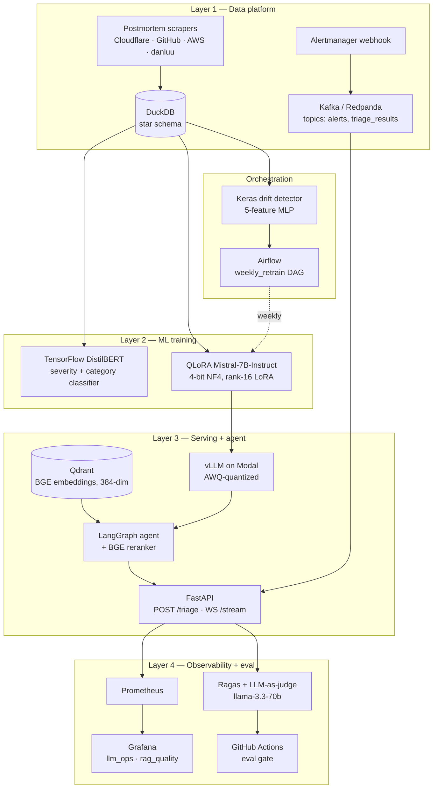

# SentinelOps Architecture

This document explains how SentinelOps is structured, what each piece does, and **why** that piece was chosen over alternatives. It is the long-form companion to the [README](../README.md). For decision records on individual choices, see [`decisions.md`](decisions.md).

---

## Goals

SentinelOps is an end-to-end MLOps system for SRE incident response. The goals — in priority order — are:

1. **Demonstrate the full ML lifecycle** end to end: data ingestion → labelling → training → eval → serving → observability → retraining.
2. **Be interview-defensible.** Every component must be explainable in two sentences, and every choice must beat its named alternatives.
3. **Run on free compute.** Total project budget: ₹0. Every tool has a free tier that lasts the project lifetime.
4. **Deploy on the same Kubernetes stack** used for traditional services, so the AI workload fits the existing SRE story rather than living in a parallel universe.

Non-goals: research novelty, multi-tenant SaaS readiness, beating closed-API frontier models on raw quality.

---

## High-level diagram



---

## End-to-end data flow

A real `/triage` call traverses the full system:

1. An **Alertmanager** webhook fires (in this project, sourced from a chaos test against the upstream ObservaShop platform).
2. The alert lands on the Redpanda topic `alerts` (Kafka API).
3. A consumer in `streaming/alert_consumer/` deserialises the alert, enriches it with service metadata from DuckDB, and POSTs it to the FastAPI service's `/triage` endpoint.
4. The **LangGraph agent** routes the alert through a state graph: pull the most recent related alerts → search Qdrant for relevant runbook chunks → rerank with BGE cross-encoder → call the **fine-tuned Mistral-7B** on Modal (vLLM + AWQ) to draft a postmortem.
5. The drafted postmortem is published back to the `triage_results` Kafka topic.
6. **Prometheus** has been scraping the FastAPI `/metrics` endpoint throughout — request latency histograms, agent tool-call counters, retrieval cache stats, and a sampled hallucination signal from a Groq-graded LLM-judge are all visible in **Grafana** dashboards.
7. **Ragas + LLM-as-judge** runs the agent against a held-out golden set in CI on every PR, blocking merges that drop faithfulness more than 5 points vs the committed baseline.
8. **Airflow** runs a weekly DAG that re-scrapes new postmortems, checks for drift via a Keras MLP detector, and conditionally triggers a Kaggle QLoRA retraining job.

---

## Layer 1 — Data platform

### Postmortem ingestion (batch)

Code: `data/scrapers/`, `data/preprocessing/`, `data/warehouse/`.

The training corpus is **2,000+ public postmortems** scraped from four sources: the curated index at `danluu/post-mortems`, Cloudflare's blog post-mortem tag, GitHub status incidents (Atom feed), and AWS public post-event summaries. Each is normalised through an HTML→text pass, deduplicated with **MinHash** (threshold 0.85, 5-word shingles, 128 permutations), and run through a **PII scrub** combining regex (emails, IPs, tokens) with **Microsoft Presidio** (names, phone numbers).

Output: `corpus.jsonl` (incident-level) and `corpus_chunks.jsonl` (400-word chunks, 80-word overlap), both loaded into DuckDB.

### Storage — DuckDB

> *"I needed a local SQL warehouse for incident analytics without running Postgres. DuckDB is columnar and fast for analytical queries on the postmortem corpus."*

A star schema (`fact_incidents`, `dim_services`, `dim_categories`) lives in a single embedded `.db` file. DuckDB was chosen over Postgres because every query against the corpus is analytical and read-heavy, and over Snowflake/BigQuery because the free tiers are time-limited or capped. dbt was rejected because at this corpus size (single-digit thousands of rows) there are at most five transformation models — dbt's value kicks in at 20+.

### Alert streaming — Kafka via Redpanda

> *"Alerts are naturally streaming; Kafka decouples alerting from ML inference so one can fail without taking down the other."*

Redpanda is a Kafka-API-compatible broker that runs as a single container with no Zookeeper dependency. It is identical from the producer/consumer side to a real Kafka cluster — every script in `streaming/` uses `aiokafka` and would work unchanged against MSK or Confluent Cloud.

Two topics:

- `alerts` — Alertmanager webhook payloads, ingested by the consumer in `streaming/alert_consumer/`.
- `triage_results` — drafted postmortems published by the agent for downstream consumers (notification, archival, audit).

The Kafka boundary is what makes the agent operationally safe: if Modal goes down or the agent times out, alerts queue rather than getting dropped, and the SRE-facing alerting path is unaffected.

---

## Layer 2 — ML training

### Non-generative baseline — TensorFlow DistilBERT

Code: `training/classifier/`. Model: [`ayushgupta7777/sentinelops-classifier`](https://huggingface.co/ayushgupta7777/sentinelops-classifier).

> *"Strong non-generative baseline to benchmark the LLM against. BERT-family classifiers are still SOTA for discriminative NLP tasks."*

A multi-task DistilBERT with two classification heads (severity 4-class, category 6-class) and a shared encoder, trained jointly. The point of this baseline is **falsifiability**: without it, every claim about the LLM has no reference point. Evaluated on a 27-example held-out set with macro-F1 ≈ 0.36 on each head — small-test caveats apply (per-class F1 has ~0.1 variance from a single misclassification on a 9-example class). The model is published with full confusion matrices and an honest limitations section in the model card.

This component is also the project's TensorFlow lifeline. Upstream `transformers` dropped TF support during development, so the live TF/Keras component is the **drift detector** described below; the classifier was migrated to PyTorch but kept as a baseline.

### Generative — QLoRA fine-tuned Mistral-7B-Instruct

Code: `training/llm/`. Models: [`ayushgupta7777/sentinelops-mistral7b-merged`](https://huggingface.co/ayushgupta7777/sentinelops-mistral7b-merged), [`-awq`](https://huggingface.co/ayushgupta7777/sentinelops-mistral7b-awq), [`-qlora-adapter`](https://huggingface.co/ayushgupta7777/sentinelops-mistral7b-qlora-adapter).

> *"QLoRA lets me fine-tune a 7B model on a single T4 with 4-bit NF4 quantization + LoRA adapters. Full fine-tuning is impossible on free compute; QLoRA is the standard approach in 2025 and produces production-quality adapters."*

**Training data.** Each postmortem is converted into an instruction-format pair: the instruction is "Given this incident summary and timeline, write a postmortem with root cause, impact, remediation, and learnings", the input is the extracted summary + timeline bullets, the output is the original postmortem body. Roughly 2,500 pairs.

**Hyperparameters.** 4-bit NF4 quantization, LoRA rank 16, alpha 32, target modules = all linear layers. Three epochs, effective batch size 16 (per-device 2 × grad accumulation 8), cosine LR schedule. Trained on Kaggle's 2×T4 free tier with TRL `SFTTrainer`. All runs logged to W&B.

**Why Mistral-7B over Llama-3.1-8B.** Either works. Mistral-7B is slightly smaller, has a cleaner base model for instruction tuning, and is licensed Apache 2.0; Llama's license is more restrictive for derivative model publishing.

**Why not full fine-tuning.** Full fine-tuning a 7B model needs ~60 GB of GPU memory at fp16. Kaggle T4s have 16 GB. QLoRA brings this to ~12 GB on a single T4 by quantising the frozen base model to 4-bit and training only ~30 M LoRA parameters in fp16.

**Why not GPT-4 / Claude via API.** Defeats the project's purpose — we want to demonstrate training, not calling. API models appear only as the LLM-as-judge grader.

**Post-training pipeline.** The trained LoRA adapter is merged back into the base model (giving the `-merged` repo on HF), then quantised with **AWQ 4-bit** (giving the `-awq` repo) which shrinks the 7B to ~4 GB VRAM with <1% quality loss. AWQ is what gets served by vLLM. The raw adapter is published separately so anyone with a base Mistral can apply it.

### Drift detector — Keras MLP

Code: `training/drift/drift_detector.py`.

A 5-feature MLP that scores feature drift between the live corpus and a reference window:

1. Mean token-length delta
2. Jensen-Shannon divergence on length histograms
3. Jaccard distance on top-1k vocabulary
4. L1 distance on severity distribution
5. L1 distance on service distribution

Trained on synthetic feature pairs (handcrafted "drift" vs "no-drift" examples). Used by the Airflow weekly DAG: if drift score > threshold, the DAG branches to trigger a retrain; otherwise it skips.

Why a separate model rather than a hard-coded threshold? The point is to demonstrate that the retrain trigger is itself a (small) ML component subject to versioning and replacement, and to keep TensorFlow as a live, serving piece of the system. ADR-001 in [`decisions.md`](decisions.md) captures the migration history that led here.

---

## Layer 3 — Serving and agent

### Inference — vLLM on Modal

Code: `serving/inference/modal_vllm.py`.

> *"vLLM's PagedAttention + continuous batching gives 2–5× throughput over naive Hugging Face inference. Modal's free credit covers the demo lifetime."*

The AWQ-quantised model is served by **vLLM** behind an OpenAI-compatible API on Modal. Modal's free tier provides $30/month in compute credits (rolling reset), more than enough for an interview-demo lifetime. vLLM was chosen over alternatives like TGI (catching up but not equivalent on throughput) and Triton (more configuration-heavy).

**Operational characteristics.** Modal scales the deployment to zero when idle. First call after idle takes **~3 minutes** while vLLM loads the 7B weights into a T4. Subsequent warm calls return in **~120–140 seconds** end-to-end through the agent — the LLM generation dominates (~80 s for ~2,500 chars), with the remainder split across BGE retrieval + reranking, the Prometheus tool, and orchestration overhead. Any client orchestrating `/triage` (Kafka consumer, Airflow task) must therefore set request timeouts ≥ 600 s or pre-warm with one direct POST.

### Vector database — Qdrant

> *"Qdrant has payload filtering, a permissive free tier, Rust performance, and runs identically local and cloud."*

Two-stage retrieval architecture:

- **Stage 1 — Dense recall.** `BAAI/bge-small-en-v1.5` (384-dim) embeds runbook chunks and historical postmortem chunks. Top-20 retrieved by cosine similarity from the `sentinelops_docs` collection (currently 2,579 chunks).
- **Stage 2 — Cross-encoder rerank.** `BAAI/bge-reranker-base` re-scores the top-20 against the query and keeps the top-5.

Qdrant payload schema: `source_type`, `service`, `severity`, `parent_id` (with `chunk_index` for stable IDs of the form `md5(parent_id::chunk_index)`). Payload indexes on `source_type` / `service` / `severity` enable filtered search (e.g. "only Cloudflare networking incidents at P0").

**Why two-stage.** Single-stage dense retrieval over-recalls topically-similar but contextually wrong chunks. The cross-encoder reranker is ~50× slower per pair than dense scoring but only runs on 20 candidates — net latency overhead is small, and faithfulness improves materially. ADR-003 in `decisions.md` captures the measurement.

**Why BGE over OpenAI / Cohere embeddings.** BGE is Apache 2.0, runs locally (no API spend), and `bge-small-en-v1.5` is at the top of the MTEB leaderboard for its size class. The reranker family from the same vendor is tuned to match.

**Why Qdrant over Pinecone / Weaviate / Chroma.** Pinecone's free tier is more restrictive (1 pod, hourly idle limits). Chroma is great for prototypes but lacks the operational maturity for production-shaped deployment. Weaviate is excellent but more configuration-heavy. Qdrant in 2025 hits the sweet spot of free-tier generosity, feature completeness (payload filtering, hybrid search, snapshots), and identical local + cloud behaviour.

### Agent — LangGraph

Code: `serving/agent/`.

> *"Incident response is multi-step with state — the agent needs to remember what it tried. LangGraph's graph-based state is the right primitive; LangChain's basic chains aren't."*

The agent is a LangGraph **state graph** with the following nodes:

- `recent_alerts` — pulls the last *N* alerts for the affected service from the `alerts` Kafka topic for context.
- `retrieve_runbooks` — Qdrant dense retrieval + BGE rerank, returns top-5 chunks.
- `query_prometheus` — *(stubbed against ObservaShop's Prometheus)* runs PromQL queries the agent generates (e.g. `rate(http_requests_total{service="checkout"}[5m])`).
- `draft_postmortem` — calls the fine-tuned Mistral-7B on Modal with a strict EVIDENCE-ONLY system prompt + retrieved contexts.
- `validate` — sanity check on the draft (length, presence of required sections).

The state graph allows the agent to remember which tools it has already called, retry with adjusted parameters (e.g. broaden the retrieval query), and short-circuit if a tool returns sufficient context early. LangChain's basic `Chain` objects do not express this cleanly — you can fake it with custom callbacks but you fight the framework. LangGraph was built for this case.

### API — FastAPI + WebSockets

Code: `serving/api/`.

Endpoints:

- `POST /triage` — full agent workflow on an alert payload. Returns the drafted postmortem, the retrieved contexts, and the tool-call trace.
- `POST /draft-postmortem` — direct postmortem generation, skipping the agent (used for offline batch generation against the golden set).
- `WS /stream` — streaming token output for interactive demos.
- `GET /healthz` — liveness probe.
- `GET /metrics` — Prometheus exposition format.

FastAPI was chosen for the async story (the agent makes many concurrent tool calls per request), the streaming support out of the box, and the standard-issue acceptance as the Python LLM-serving framework in 2025.

### Demo UI — Vite + React + TypeScript

Code: `serving/ui/`.

A single-page React frontend (Vite + TypeScript + Tailwind) for the `/triage` endpoint, designed as the clickable surface for the demo video and as a reference deployment for an internal SRE-tooling UI. Dev-tool aesthetic — dark theme, amber accent, JetBrains Mono for technical fields. Includes pre-loaded sample alerts, a live latency counter during the request, and four result tabs (Postmortem / Evidence with rerank scores / synthesized Tool trace / Raw JSON). Deployed via `vite build` to any static host (Vercel, HF Spaces, Cloudflare Pages, Nginx ConfigMap).

The UI exists separately from the API service so the two can be deployed independently — the API is a backend service, the UI is a thin client.

---

## Layer 4 — Observability and evaluation

### Metrics — Prometheus + Grafana

Code: `observability/`.

The same `kube-prometheus-stack` chart that runs on the upstream ObservaShop project is reused here. Two custom dashboards:

- **`llm_ops.json`** — request rate by endpoint, latency p50/p95/p99 histograms, time-to-first-token, output throughput, cumulative cost, cost rate per model.
- **`rag_quality.json`** — retrieval Precision@5, sampled hallucination rate (LLM-judge), cache hit ratio, cache lookups vs hits, agent tool-call counts and outcomes.

Key custom metrics emitted by the FastAPI app:

```
llm_request_duration_seconds_bucket{endpoint, model}
llm_tokens_per_second{model}
llm_time_to_first_token_seconds_bucket{model}
llm_cost_usd_total{model}
rag_retrieval_precision_at_5
rag_cache_hit_ratio
rag_cache_lookups_total / rag_cache_hits_total
agent_tool_call_total{tool, outcome}
hallucination_rate (sampled via LLM-as-judge)
```

**Known gap.** vLLM-internal metrics (TTFT, throughput) live on the Modal side and are not currently scraped — wiring a Modal `/metrics` exporter into in-cluster Prometheus is on the polish list.

### Evaluation — Ragas + LLM-as-judge

Code: `evaluation/`.

> *"I can't hire human annotators. LLM-as-judge with a stronger model grading my fine-tuned model is standard; I validate the grader with a small human-labelled spot-check."*

**Two-tier judging:**

- **Canonical — `llama-3.3-70b-versatile` via Groq Batch API.** Used for the headline numbers in this document and the model card. The Batch API avoids the live-API 100K TPD ceiling that would otherwise block every PR within a single rolling 24-hour window. Run on a 20-case golden set.
- **CI inner-loop — `llama-3.1-8b-instant` via Groq live API.** Used for every PR. Fast (≈25 minutes for 10 cases), cheap, and the relative-delta-vs-baseline gate doesn't require an absolute-quality grader. The 8B model has a 6K-TPM per-request hard ceiling, so contexts are truncated to 800 chars and answers to 1500 chars in `evaluation/ragas_suite.py` to stay safely under.

**Four Ragas metrics computed:** faithfulness, answer relevancy, context precision, context recall. All four show up on the RAG quality dashboard; faithfulness is the one the gate enforces.

The committed CI baseline lives at `evaluation/baselines/main_8b.json`. Every PR's eval output is compared against this baseline; a faithfulness drop of more than 5 points fails the build.

### Eval gate — GitHub Actions

Code: `.github/workflows/`.

```
PR opened
  ├── lint (ruff)
  ├── type-check (mypy)
  ├── unit tests (pytest)
  ├── trivy CVE scan
  └── ragas eval gate ← blocks merge if faithfulness − baseline > 5 points
```

The eval gate **does not call Modal in CI**. Modal is a paid resource and CI machines do not have credentials. Instead, when changes touch `serving/agent/` or `serving/rag/`, the developer regenerates `eval_inputs.jsonl` locally (hitting Modal once) and commits the regenerated inputs; the CI gate then grades these committed agent outputs with the 8B judge. ADR-004 in `decisions.md` covers the rationale.

---

## Cross-cutting — Orchestration, deployment, CI

### Airflow — weekly retraining

Code: `orchestration/airflow/dags/weekly_retrain_dag.py`.

> *"Re-training is scheduled, not one-shot. Airflow handles retries, backfills, and dependency management."*

A weekly DAG with seven tasks:

```
scrape_new_postmortems
  → preprocess
  → load_to_duckdb
  → drift_check ── (BranchPythonOperator)
                    ├── trigger_kaggle_retrain → register_in_mlflow → end
                    └── no_retrain → end
```

The `drift_check` task loads the trained Keras MLP from `training/drift/` and computes a drift score against the live corpus. The branch operator routes downstream based on the score (with an `Variable.get('force_drift_score')` override for testing). Real-evidence runs land in the chat-2 handoff: a `force_drift_score=0.85` run triggers retrain, a real-feature-compute run with score 0.0051 routes to no_retrain.

Airflow runs as a `docker-compose` service rather than in Kubernetes — the project already uses kind for the serving stack and cohabiting Airflow there crowds the 16 GB host RAM. The compose service uses a custom image (`apache/airflow:2.10.3` + `tensorflow-cpu==2.17.0` + `numpy==1.26.4`) so the drift detector can load inside the Airflow worker. Host port `8081` (kind ingress holds 8080 for ObservaShop).

### Deployment — kind + Helm + ArgoCD

Code: `deploy/helm/sentinelops/`, `argocd/`.

- **kind** for the local Kubernetes cluster (3 nodes, named `sentinelops`).
- **Helm** with a single reusable microservice chart at `deploy/helm/sentinelops/microservice/` — values per service. Reused from the ObservaShop project.
- **ArgoCD** (GitOps) syncs Applications from this repository to the cluster. Multi-source apps reading values from the git ref require `git push` for ArgoCD to see changes; force-sync with `kubectl patch application <name> -n argocd --type=merge -p '{"operation":{"sync":{}}}'`.

The chart emits **ServiceMonitor** objects for `kube-prometheus-stack` to discover, with the required `release: kube-prometheus-stack` label set under `serviceMonitor.additionalLabels` in the chart values.

### CI/CD — GitHub Actions

The eval gate is the differentiating piece. The rest is standard:

- **Trivy** scans container images for high/critical CVEs on every push.
- Path-filtered matrix builds — only the services touched by a PR are rebuilt.
- Branch-protection on `main` requires all checks green before merge.

---

## Trade-offs and rejected alternatives

Every alternative considered carries a rehearsed rejection rationale. The key ones for this architecture:

| Considered | Rejected because |
| --- | --- |
| Apache Spark | 2,500-row corpus, not billions. Spark adds complexity without depth on an AI/ML project. |
| Snowflake | 30-day time-limited free tier. DuckDB gives identical SQL locally, forever. |
| LangChain basic chains | Multi-step state needs a graph, not a chain. |
| Full fine-tuning | Impossible on free compute for 7B. QLoRA is the standard alternative. |
| GPT-4 / Claude via API | Defeats the purpose — we want to demonstrate training. |
| Pinecone / Weaviate / Chroma | Worse free tier or weaker operational story than Qdrant in 2025. |
| TGI / Triton | vLLM PagedAttention is best-in-class throughput; TGI is catching up; Triton is config-heavy. |
| Human annotators for eval | No budget. LLM-as-judge with a stronger model + small spot-check is the standard workaround. |

---

## What's deliberately out of scope

- **Multi-tenancy / RBAC.** Single-tenant demo. Adding org-scoped Qdrant collections, JWT auth, and per-tenant rate-limiting would double the surface area without strengthening the core ML story.
- **Online learning / RLHF.** Weekly batch retrain via Airflow is the upper bound. Online updates to a 7B model on free compute are not realistic.
- **Cross-region HA.** Single kind cluster on a laptop. Kubernetes is the deployment target, not the operational target.
- **Bigger evaluation set.** 20-case golden + 10-case CI fast set. A 100-case set is on the backlog and would change every reported number.

---

## Where to next

- [`decisions.md`](decisions.md) — Architecture Decision Records for the choices summarised above.
- [`model_card.md`](model_card.md) — Training data, eval methodology, failure modes, intended use, limitations.
- [`demo.md`](demo.md) — One-shot reproduction from a clean repo.
- [`runbooks/`](runbooks/) — The runbook chunks the agent retrieves at inference time.
