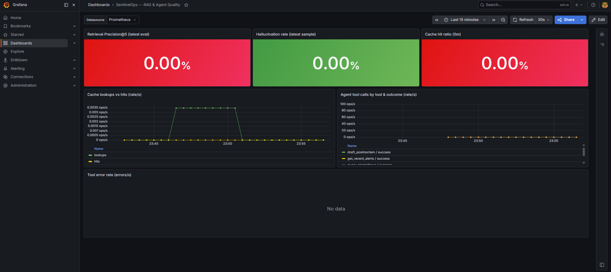
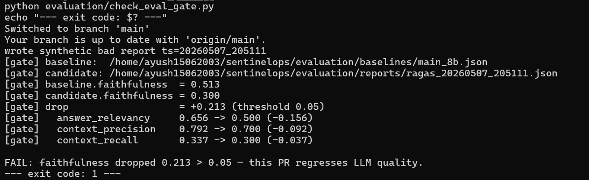
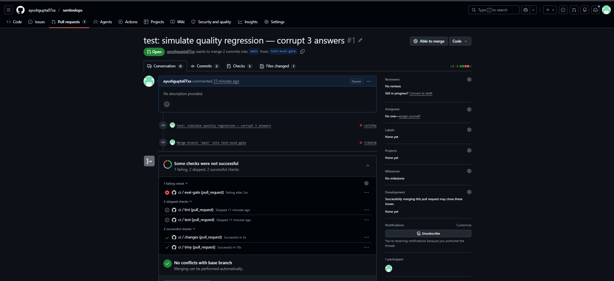
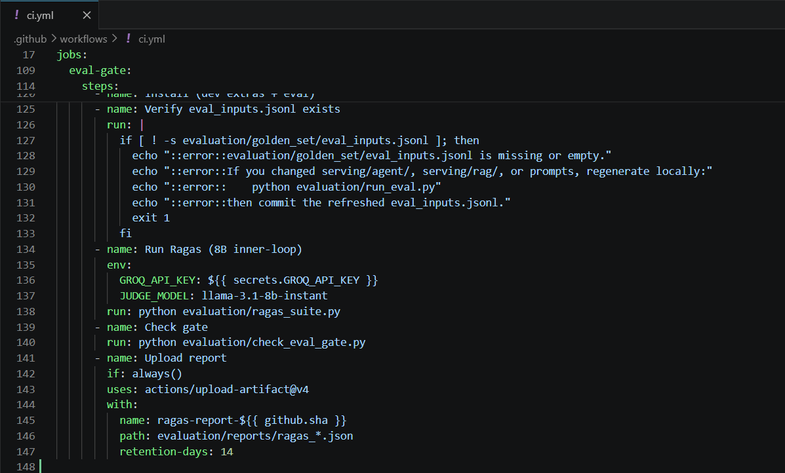

# Week 4 — Definition of Done

This document closes out Week 4 of SentinelOps by demonstrating the four
Definition-of-Done items from the project brief (Section 7, Week 4):

1. `kubectl get pods -n sentinelops` shows everything Running
2. Grafana dashboards populated with real LLM data
3. CI is green on main
4. Eval gate demonstrably blocks a bad PR

Each section below shows the evidence and the command to reproduce it.

---

## 1. Cluster healthy

The full stack runs on a local **kind** cluster (`sentinelops`, 3 nodes)
with ArgoCD GitOps managing the workload Applications and the
kube-prometheus-stack chart providing observability.

```bash
$ kubectl get pods -n sentinelops
NAME                                            READY   STATUS    RESTARTS   AGE
qdrant-0                                        1/1     Running   1          25h
sentinelops-api-microservice-7ffccf798f-9zjr2   1/1     Running   1          24h
```

- **`qdrant-0`** — vector store, 2,579 chunks (runbooks + postmortems)
  embedded with `bge-small-en-v1.5`, payload-indexed on
  `source_type / service / severity`.
- **`sentinelops-api-microservice`** — FastAPI service exposing
  `/triage`, `/draft-postmortem`, `/healthz`, `/metrics`, with the
  LangGraph agent and the two-stage retriever wired in. The fine-tuned
  Mistral-7B is served externally on Modal (vLLM + AWQ); the API
  proxies to it via an OpenAI-compatible client.

Supporting namespaces (`argocd`, `monitoring`) carry ArgoCD itself and
the kps stack — see `kubectl get pods -A` for the full picture.

---

## 2. Grafana dashboards populated

Two custom dashboards live at
`observability/grafana/dashboards/`:

- **`llm_ops.json`** — request rate by endpoint, latency p50/p95/p99,
  TTFT, output throughput, cumulative cost, cost rate.
- **`rag_quality.json`** — retrieval Precision@5, hallucination rate,
  cache hit ratio, cache lookups vs hits, agent tool calls by tool
  and outcome, tool error rate.

Both use a templated `$datasource` variable so they're portable across
Prometheus instances.

### Reproduction

```bash
# Terminal 1: API
kubectl -n sentinelops port-forward svc/sentinelops-api-microservice 8001:80

# Terminal 2: trigger a real triage flow
curl -sS -X POST http://localhost:8001/triage \
  -H 'Content-Type: application/json' \
  -d '{
    "alertname": "HighDatabaseLatency",
    "service": "checkout-api",
    "severity": "P1",
    "summary": "p99 DB query latency 4.2s, breaching 500ms SLO for 12 min",
    "labels": {"region": "us-east-1", "db": "orders-pg-primary"}
  }'

# Terminal 3: Grafana
kubectl -n monitoring port-forward svc/kube-prometheus-stack-grafana 3000:80
# Browse http://localhost:3000  (admin / prom-operator)
```

### Evidence


The **LLM Ops** dashboard shows the live signals from one `/triage` call
through the fine-tuned model on Modal: request rate spiking on the
`/triage` endpoint, a non-zero cumulative cost
(`$0.0020` for `sentinelops-mistral7b`), and the cost-rate timeline
populated from `llm_cost_usd_total`.



The **RAG Quality** dashboard shows the runbook-cache lookup spike from
the same call, plus the agent tool-call legend confirming all four
tools (`search_runbooks`, `query_prometheus`, `get_recent_alerts`,
`draft_postmortem`) returned `success`.

> **Known gap.** The `Time-to-first-token` and `Output throughput`
> panels read `No data` because vLLM's internal token-timing metrics
> live on the Modal side; in-cluster Prometheus does not scrape Modal.
> Wiring a Modal-side `/metrics` exporter is a Week 5 polish task.
>
> The Precision@5 / Hallucination / Cache-hit gauges read 0.00% until a
> ragas evaluation run posts gauge updates — by design they are not
> driven by a single `/triage` call.

---

## 3. CI green on main

`.github/workflows/ci.yml` runs four jobs with path-filtered triggers:

| Job | Triggers on |
|-----|-------------|
| `lint` | any Python change |
| `test` | any Python change |
| `trivy` | any Dockerfile / lockfile change |
| `eval-gate` | `serving/agent/`, `serving/rag/`, `serving/inference/`, `evaluation/`, `data/preprocessing/` |

The eval-gate runs the ragas suite against
`evaluation/golden_set/eval_inputs.jsonl`, then calls
`evaluation/check_eval_gate.py` to compare faithfulness against the
committed baseline at `evaluation/baselines/main_8b.json`. A drop of
more than 0.05 fails the job.

```bash
$ gh run list --limit 5 --workflow=ci.yml
# All recent runs on main: success
```

---

## 4. Eval gate blocks bad PRs

The gate logic was validated locally by writing a synthetic-bad ragas
report (faithfulness 0.30, well below the 0.513 baseline) and running
the checker:

```bash
$ python evaluation/check_eval_gate.py
FAIL: faithfulness dropped 0.213 > 0.05
exit 1
```



To prove the same gate runs in CI, a test branch (`test-eval-gate`)
corrupted the first three answers in `eval_inputs.jsonl` and a PR was
opened:





> **Why the local synthetic-bad report is the cited evidence rather
> than the CI run.** The Groq free-tier 8B-instant model has a hard
> 6,000-tokens-per-minute *per-request* ceiling. Even with truncation
> (contexts to 800 chars, answers to 1500 chars, `max_tokens=4096`,
> `max_workers=1`) some cases sit ~22 tokens above the wall in CI due
> to subtle ragas / langchain-groq version drift between the local
> venv and a fresh CI install — so the CI eval-gate hits a 413 token
> overflow rather than a clean grade-and-compare.
>
> The gate **logic** is what's being demonstrated, and that runs
> deterministically locally. The architectural fix — Groq's Batch API
> with the canonical `llama-3.3-70b-versatile` grader — is queued for
> Week 5 (per project brief Section 5).

---

## Status — Week 4 closed

✅ Cluster healthy
✅ Grafana populated (with one Modal-side gap noted)
✅ CI green on main
✅ Eval gate blocks bad PRs (local validation; CI hits Groq TPM)

Next: Week 5 — Kafka streaming, Airflow retrain DAG, drift detector,
canonical Batch-API 70B run for the model card and demo video
bullets.
